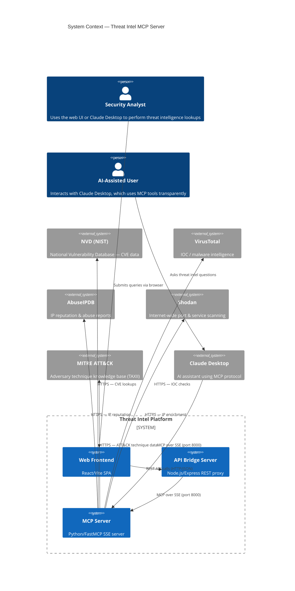
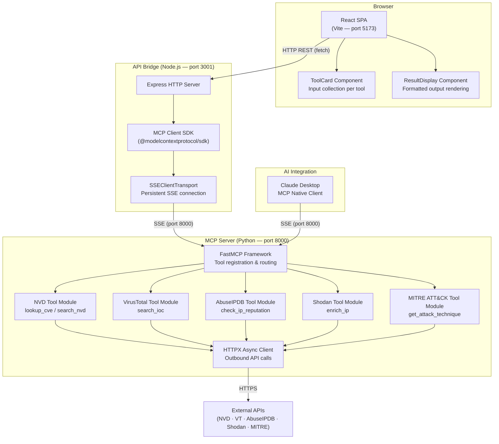
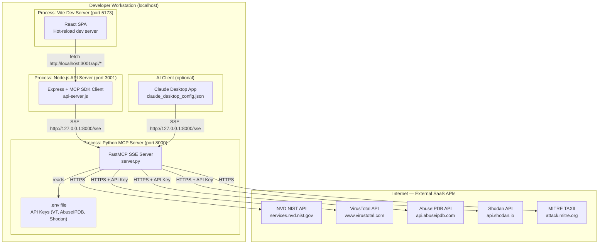
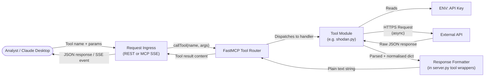
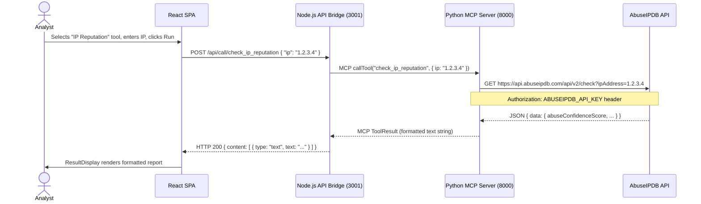
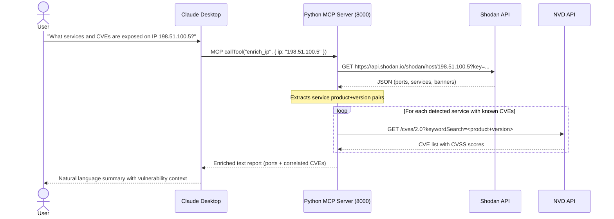
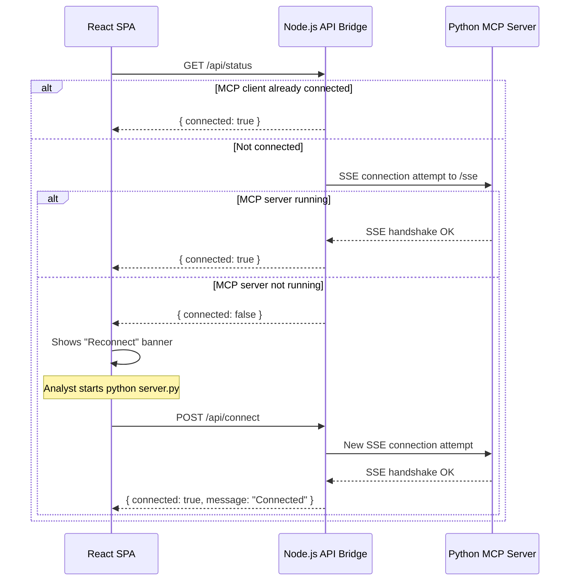
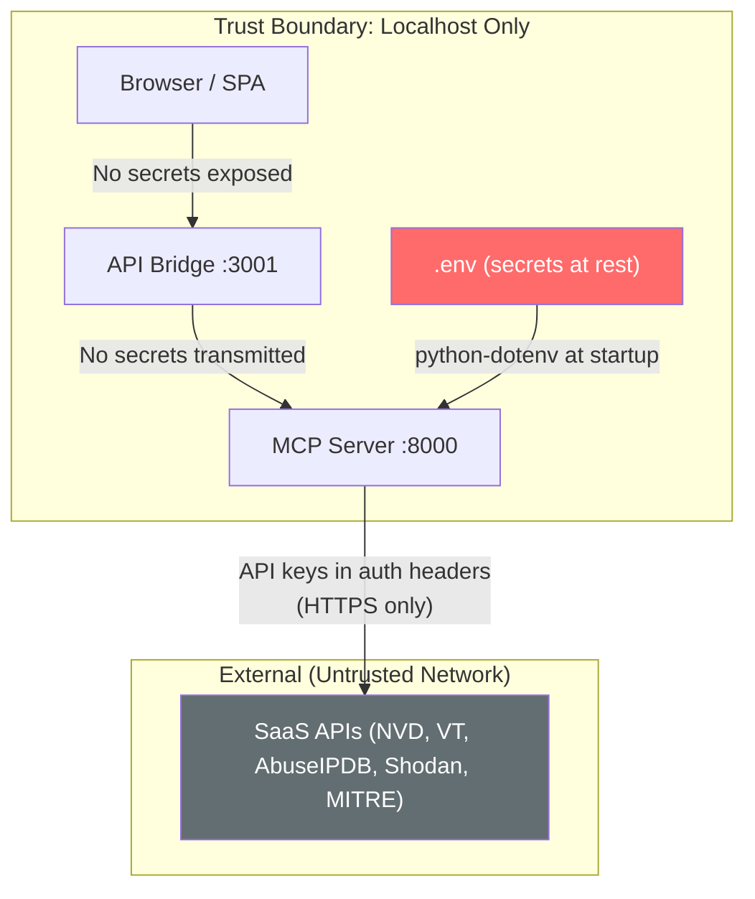
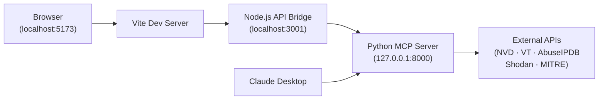
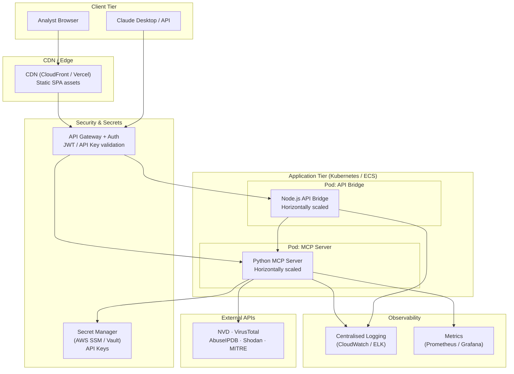

# Threat Intel MCP Server — Architecture Plan

## Executive Summary

The **Threat Intel MCP Server** is a cybersecurity intelligence platform that aggregates data from five external threat intelligence and vulnerability sources (NVD, VirusTotal, AbuseIPDB, Shodan, and MITRE ATT&CK) and exposes them through the **Model Context Protocol (MCP)**. It serves two distinct consumer paths: an AI assistant integration (Claude Desktop) and a React-based web UI. The system is designed as a thin, stateless aggregation layer that normalises and proxies threat intelligence queries — no data is persisted locally.

---

## System Context

### Explanation

**Overview**: The system sits between security analysts (human or AI-assisted) and five authoritative external intelligence sources. It unifies them behind a single MCP interface.

**Key Actors**:
| Actor | Role |
|---|---|
| Security Analyst | Direct web UI user performing manual investigations |
| AI-Assisted User | Uses Claude Desktop; the LLM autonomously invokes MCP tools |
| NVD | Provides CVE details and CVSS scoring (public, no key required) |
| VirusTotal | Malware and IOC intelligence (API key required) |
| AbuseIPDB | IP abuse history and confidence scoring (API key required) |
| Shodan | Internet-wide scanning data — open ports and services (API key required) |
| MITRE ATT&CK | Structured adversary technique knowledge base (public TAXII) |
| Claude Desktop | MCP-native client that consumes tools directly over SSE |

**Design Decision**: Two separate consumer paths (web UI and Claude Desktop) converge on a single MCP server, avoiding duplication of business logic. The Node.js API bridge exists solely to translate REST calls from the browser into MCP protocol calls — a thin adapter layer.

---

## Architecture Overview

The platform follows a **layered proxy architecture**:

1. **Presentation Layer** — React/Vite SPA (port 5173 in dev)
2. **API Bridge Layer** — Node.js/Express REST-to-MCP adapter (port 3001)
3. **MCP Tool Layer** — Python FastMCP server with tool handlers (port 8000, SSE transport)
4. **Integration Layer** — Async HTTPX calls to third-party APIs

Key architectural patterns applied:
- **Adapter Pattern** — The Node.js server adapts HTTP REST to MCP protocol
- **Tool/Plugin Pattern** — Each intelligence source is an independently registered MCP tool
- **Aggregation Gateway** — The MCP server acts as a single gateway to multiple upstream APIs
- **Stateless Request Processing** — No database; every call is a live outbound API query

---

## Component Architecture

### Explanation

**Overview**: The component diagram shows the internal structure across three tiers, plus the AI integration path.

**Key Components**:

| Component | Responsibility |
|---|---|
| React SPA | Presents tool UI; collects inputs; renders results |
| ToolCard | Renders per-tool input form (inputs defined declaratively in TOOLS config) |
| ResultDisplay | Formats and renders the raw string response from the MCP server |
| Express Server | Receives REST calls from the browser; routes to MCP client |
| MCP Client SDK | Manages the SSE connection lifecycle; calls `listTools` and `callTool` |
| FastMCP | Registers async tool functions; handles SSE transport; routes calls to tool modules |
| Tool Modules (×5) | Each module encapsulates auth, request construction, response parsing for one data source |
| HTTPX Async Client | Non-blocking HTTP client shared across all tool modules |
| Claude Desktop | Out-of-band AI client; connects directly over SSE, no REST bridge needed |

**Design Decision**: Tool modules are isolated — adding a new intelligence source requires only creating a new `tools/newtool.py` and registering it in `server.py`. No changes to the API bridge or frontend routing are needed for new MCP tools (Claude discovers them dynamically). The web frontend does require a new entry in the `TOOLS` constant, but this is a UI-only concern.

---

## Deployment Architecture

### Explanation

**Overview**: The current deployment is entirely local (developer-grade). All three processes run on localhost. Production cloud deployment is covered in the Phased Development section.

**Infrastructure Components**:
| Component | Port | Tech | Notes |
|---|---|---|---|
| Vite Dev Server | 5173 | Node.js | Dev only; production uses static build |
| API Bridge | 3001 | Node.js/Express | Thin proxy; stateless |
| MCP Server | 8000 | Python/uvicorn (via FastMCP) | Core logic; SSE transport |
| `.env` file | — | python-dotenv | Secrets never committed to VCS |

**Security Zones**:
- All inter-process communication is loopback (127.0.0.1) — unexposed to the network
- API keys are read at startup from `.env`; not passed through the Node.js layer
- External calls use HTTPS exclusively

**NFR — Security**: API keys are isolated to the Python process only. The Node.js API bridge never handles raw secret values. No secrets cross the browser boundary.

**NFR — Reliability**: The Node.js MCP client implements lazy reconnection — if the Python server is unavailable, it retries on the next request. The `/api/status` endpoint allows the UI to surface connection health.

---

## Data Flow

### Explanation

**Overview**: All data flows are synchronous request-response; no message queues, no caching, no local storage.

**Data Handling Steps**:
1. **Ingress** — Input arrives either as JSON over REST (web path) or as an MCP `CallToolRequest` over SSE (Claude path)
2. **Routing** — FastMCP's decorator-based registration matches tool name to the correct async handler
3. **Key Injection** — Each tool module fetches its API key from environment variables at call time (not startup), allowing key rotation without restart
4. **External Request** — HTTPX fires an async HTTPS request; `timeout=30s` applied to all calls
5. **Normalisation** — Raw API-specific JSON is parsed into a clean Python dict with consistent field names
6. **Formatting** — `server.py` wrappers convert dicts to human-readable plain text strings suitable for display in Claude or the UI
7. **Response** — The string is returned as MCP `TextContent` and propagated back to the caller

**Data Classification**:
- **Input**: IP addresses, CVE IDs, domain names, file hashes, technique IDs — analyst-supplied query parameters
- **Output**: Structured text — CVSS scores, abuse reports, port/service data, ATT&CK technique details — sourced entirely from external authoritative databases
- **No PII stored**: The system never persists query inputs or API responses

**NFR — Performance**: HTTPX async client ensures no thread blocking. Each tool call has a 30-second timeout. Response sizes are capped (e.g., NVD references limited to 10, AbuseIPDB reports limited to 5 recent entries) to control payload size.

---

## Key Workflows

### Workflow 1 — Web UI Tool Invocation (e.g. IP Reputation Check)

### Workflow 2 — Claude Desktop AI-Assisted Investigation

### Workflow 3 — Connection Health Check & Reconnect

### Explanation

**Workflow 1** highlights the REST → MCP → External API chain for the web path. The Node.js client maintains a lazy singleton MCP connection — on error, `mcpClient` is set to `null` and the next call retriggers connection.

**Workflow 2** shows how Claude autonomously chains tool calls. The `enrich_ip` tool internally makes secondary NVD queries for CVE correlation — this is a compound tool that aggregates two external sources in one call.

**Workflow 3** shows the resilience mechanism: the UI polls `/api/status` and offers a manual reconnect option. This eliminates the need for process supervision in the development setup.

---

## Security Architecture

### Security Controls

| Concern | Current Control | Recommendation |
|---|---|---|
| API Key Storage | `.env` file (not committed) | Secret manager (Vault, AWS SSM) in production |
| API Key Exposure | Keys only loaded in Python process; never traverse Node.js or browser | Enforce via code review / secrets scanner |
| Network Exposure | All ports bound to `127.0.0.1` | Add auth middleware before any network-facing deployment |
| Transport Encryption | All external calls use HTTPS | Add mTLS for internal service mesh in production |
| Input Validation | Minimal (passed directly to external APIs) | Add input sanitisation and allowlist patterns (CVE format, IP regex) |
| Auth on MCP Endpoint | None (localhost only) | Add bearer token / API key check on SSE endpoint for cloud deployment |
| Dependency Security | No lockfile for Python (`requirements.txt` version ranges) | Pin dependencies; run `pip audit` / `npm audit` in CI |

---

## Phased Development Approach

### Phase 1 — Current State (Local Development / Single-User)

**Characteristics**: All processes on a single machine. No auth. No caching. No observability. Suitable for solo analyst or development/testing use.

---

### Phase 2 — Team Deployment (Cloud / Containerised)

### Migration Path

| Step | Action |
|---|---|
| **Step 1** | Containerise each process with Docker (`Dockerfile` per service) |
| **Step 2** | Add `docker-compose.yml` to replace the three manual process starts |
| **Step 3** | Replace `.env` with AWS SSM / HashiCorp Vault; inject via env vars at container startup |
| **Step 4** | Add authentication middleware to the Express API Bridge (JWT or API key header) |
| **Step 5** | Build React SPA for production (`npm run build`); deploy to CDN |
| **Step 6** | Add response caching layer (Redis) for high-frequency, slowly-changing data (MITRE ATT&CK, NVD CVE lookups) |
| **Step 7** | Deploy API Bridge and MCP Server to Kubernetes/ECS with horizontal pod autoscaling |
| **Step 8** | Add structured logging and metrics instrumentation |

---

## Non-Functional Requirements Analysis

### Scalability

- **Current**: Single-process Python server; concurrency handled by `asyncio` (FastMCP uses an async event loop, allowing multiple simultaneous tool calls without threads)
- **Bottleneck**: External API rate limits (e.g., VirusTotal free tier: 4 req/min) will throttle throughput before the server saturates
- **Scale path**: Horizontal scaling of both Node.js and Python containers behind a load balancer; add per-user rate limiting to stay within upstream quotas; implement a request queue (Celery/RQ) for long-running Shodan enrichments

### Performance

- **Response times**: Dominated by external API latency (typically 500ms–5s). Internal processing is negligible
- **Optimisation opportunities**:
  - Cache MITRE ATT&CK technique data (changes infrequently; cache TTL: 24h)
  - Cache NVD CVE lookups (TTL: 6h)
  - Parallelise the Shodan `enrich_ip` CVE correlation loop with `asyncio.gather()`
  - Limit AbuseIPDB recent report payload to reduce response size
- **Timeout strategy**: Current 30s timeout per tool call is appropriate for Shodan; consider shorter timeouts (5–10s) for simpler lookups

### Security

- **Critical gap**: No authentication on any endpoint in the current local deployment
- **Priority actions**: Add API key / JWT auth before any network-accessible deployment; implement input validation (CVE ID regex, IP address validation) to prevent injection-style abuse of upstream APIs; never log raw API keys; rotate external API keys periodically
- **Data sensitivity**: Query inputs (IPs, hashes, domains) may be sensitive; ensure they are not logged in plain-text in production

### Reliability

- **Current**: No retry logic, no circuit breaker, no graceful degradation. If an external API is down, the tool returns an error string
- **Improvements**:
  - Add retry with exponential backoff (HTTPX retry middleware or `tenacity` library)
  - Add per-source circuit breaker: mark a source as "unavailable" after N consecutive failures, surface this in tool responses
  - MCP server health endpoint (currently provided by FastMCP's default `/health`)
  - Node.js MCP client reconnect logic is present but has no backoff — add exponential backoff on reconnection attempts

### Maintainability

- **Strengths**: Excellent separation of concerns — each integration source is a self-contained module. Tool registration is declarative (`@mcp.tool()` decorator). The `TOOLS` config array in `App.jsx` drives the entire frontend UI declaratively
- **Improvements**:
  - Add type hints and Pydantic models for tool return types to enable schema validation
  - Add integration tests per tool module (stubs/mocks for external APIs)
  - Add API versioning to the Express bridge (`/api/v1/call/...`) for forward compatibility
  - Document the `.env.example` template with all required and optional keys and their sources

---

## Risks and Mitigations

| Risk | Likelihood | Impact | Mitigation |
|---|---|---|---|
| External API key compromise | Medium | High | Use secret manager; rotate keys; restrict API key permissions to minimum scope |
| External API rate limiting | High | Medium | Implement per-source rate limiting and caching; monitor quota usage |
| Upstream API deprecation / change | Medium | Medium | Isolate each API in its own module; monitor provider changelogs; add contract tests |
| No auth on MCP SSE endpoint | Low (localhost only) | Critical (if exposed) | Add auth before any network deployment; bind to 127.0.0.1 only in local mode |
| Python dependency vulnerabilities | Low | Medium | Pin dependency versions; run `pip audit` in CI |
| Single point of failure (local) | High | Medium | Acceptable for dev; mitigated in Phase 2 via containerisation and health checks |
| Slow Shodan enrichment blocking | Medium | Low | Move to async queue pattern for compound/multi-step tool calls |

---

## Technology Stack Recommendations

| Layer | Current | Production Recommendation | Rationale |
|---|---|---|---|
| MCP Server | Python 3.x + FastMCP | Same + uvicorn + gunicorn | FastMCP is idiomatic; add production ASGI wrapper |
| API Bridge | Node.js + Express | Same + Fastify (optional) | Express is sufficient; Fastify for higher throughput |
| Frontend | React 18 + Vite | Same + Nginx (static serving) | Build to static assets; serve from CDN |
| Secret Management | `.env` file | AWS SSM / HashiCorp Vault | Centralised rotation and audit |
| Caching | None | Redis | Low-latency TTL cache for repeat queries |
| Containerisation | None | Docker + Docker Compose → Kubernetes | Consistent environments; horizontal scaling |
| CI/CD | None | GitHub Actions | Lint, test, build, push on PR/merge |
| Observability | Console logs | OpenTelemetry + Grafana | Distributed tracing across Node.js ↔ Python |
| Auth | None | JWT (Auth0 / Cognito) | Standard bearer token auth for API bridge |

---

## Next Steps

1. **Immediate** — Add input validation to all tool handlers (CVE format check, IP address validation) to harden the current local deployment
2. **Short-term** — Pin all Python and Node.js dependencies to exact versions; add `pip audit` and `npm audit` to a basic CI pipeline
3. **Short-term** — Dockerise all three services and create a `docker-compose.yml` to simplify local startup (replacing three manual terminal sessions)
4. **Medium-term** — Implement Redis caching for MITRE ATT&CK and NVD responses; add retry/backoff with `tenacity` to all HTTPX calls
5. **Medium-term** — Add authentication middleware to the Express API Bridge before any shared or cloud deployment
6. **Long-term** — Migrate secret management to AWS SSM or HashiCorp Vault; deploy to Kubernetes with horizontal autoscaling and centralised observability
